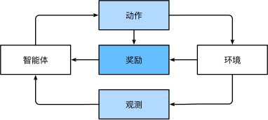

# 机器学习的一些概念
**机器学习**（machine learning，ML）是一类强大的可以从经验中学习的技术。 通常采用观测数据或与环境交互的形式，机器学习算法会积累更多的经验，其性能也会逐步提高。
## 1.1机器学习中的关键组件
首先介绍一些核心组件。无论什么类型的机器学习问题，都会遇到这些组件：
- 1.可以用来学习的**数据**（data）；
- 2.如何转换数据的**模型**（model）；
- 3.一个**目标函数**（objective function），用来量化模型的有效性；
- 4.调整模型参数以优化目标函数的**算法**（algorithm）。
### 1.1.1数据
 每个数据集由一个个**样本**（example, sample）组成,每个样本由**特征向量**（feature vector）和**标签**（label）组成。特征向量是样本的特征或属性，
 标签是样本的输出或目标。特征向量通常表示为x，标签通常表示为y。

当处理图像数据时，每一张单独的照片即为一个样本，它的特征由每个像素数值的有序列表表示。 比如，200×200 彩色照片由200×200× 3 = 120,000个数值组成，其中的“3”对应于每个空间位置的红、绿、蓝通道的强度。 

当每个样本的特征类别数量都是相同的时候，其特征向量是固定长度的，这个长度被称为数据的**维数**（dimensionality）。 固定长度的特征向量是一个方便的属性，它可以用来量化学习大量样本。

然而，并不是所有的数据都可以用“固定长度”的向量表示。 以图像数据为例，如果它们全部来自标准显微镜设备，那么“固定长度”是可取的； 但是如果图像数据来自互联网，它们很难具有相同的分辨率或形状。 这时，将图像裁剪成标准尺寸是一种方法，但这种办法很局限，有丢失信息的风险。 此外，文本数据更不符合“固定长度”的要求。 

与传统机器学习方法相比，深度学习的一个主要优势是可以处理不同长度的数据。

### 1.1.2模型
深度学习与经典方法的区别主要在于：前者关注的功能强大的模型，这些模型由神经网络错综复杂的交织在一起，包含层层数据转换，因此被称为深度学习（deep learning）。

### 1.1.3目标函数
前面的内容将机器学习介绍为“从经验中学习”。 这里所说的“学习”，是指自主提高模型完成某些任务的效能。 但是，什么才算真正的提高呢？ 

在机器学习中，我们需要定义模型的优劣程度的度量，这个度量在大多数情况是“可优化”的，这被称之为**目标函数**（objective function）。 

我们通常定义一个目标函数，并希望优化它到最低点。 因为越低越好，所以这些函数有时被称为**损失函数**（loss function，或cost function）。 但这只是一个惯例，我们也可以取一个新的函数，优化到它的最高点。 这两个函数本质上是相同的，只是翻转一下符号。

当任务在试图预测数值时，最常见的损失函数是**平方误差**（squared error），即预测值与实际值之差的平方。

通常，损失函数是根据模型参数定义的，并取决于数据集。 在一个数据集上，我们可以通过最小化总损失来学习模型参数的最佳值。 该数据集由一些为训练而收集的样本组成，称为训练数据集（training dataset，或称为训练集（training set））。 然而，在训练数据上表现良好的模型，并不一定在“新数据集”上有同样的性能，这里的“新数据集”通常称为测试数据集（test dataset，或称为测试集（test set））。这种情况被称为**过拟合**（overfitting）。

### 1.1.4优化算法
当我们获得了一些数据源及其表示、一个模型和一个合适的损失函数，接下来就需要一种算法，它能够搜索出最佳参数，以最小化损失函数。 深度学习中，大多流行的优化算法通常基于一种基本方法–**梯度下降**（gradient descent）。 

简而言之，在每个步骤中，梯度下降法都会检查每个参数，看看如果仅对该参数进行少量变动，训练集损失会朝哪个方向移动。 然后，它在可以减少损失的方向上优化参数。

## 1.2监督学习
**监督学习**（supervised learning）擅长在“给定输入特征”的情况下预测标签。 每个“特征-标签”对都称为一个样本（example）。 有时，即使标签是未知的，样本也可以指代输入特征。 我们的目标是生成一个模型，能够将任何输入特征映射到标签（即预测）。

### 1.2.1回归
回归问题是一种统计学习方法，主要用于预测数值型目标变量。在回归问题中，我们试图找到输入变量（自变量）和目标变量（因变量）之间的关系，这种关系通常用数学函数来表示。回归分析可以用来预测、解释或者描述两个或多个变量之间的关系。

以下是回归问题的一些基本类型：

- 线性回归：最简单的回归形式，它假设因变量与自变量之间存在线性关系。
- 多元回归：涉及两个以上的自变量。
- 逻辑回归：虽然名字中有“回归”，但其实是用于分类问题的一种方法。它预测的是概率，通常用于二分类问题。
- 岭回归和Lasso回归：当数据集中的特征数量多于样本数量，或者特征之间存在多重共线性时，这两种方法可以用来处理这些问题。
- 多项式回归：用于描述因变量和自变量之间的非线性关系。
- 逐步回归：一种用于选择重要变量的方法，通过逐步添加或移除变量来构建模型。
- 套索回归（Lasso）：通过惩罚回归系数的大小，来提高模型的解释性并防止过拟合。
- 弹性网络（Elastic Net）：是岭回归和Lasso回归的混合版本，它通过结合两者的惩罚项来提高预测的准确性。
### 1.2.2分类
虽然回归模型可以很好地解决“**有多少**”的问题，但是很多问题并非如此。 例如，一家银行希望在其移动应用程序中添加支票扫描功能。 具体地说，这款应用程序能够自动理解从图像中看到的文本，并将手写字符映射到对应的已知字符之上。 这种“**哪一个**”的问题叫做分类（classification）问题。 分类问题希望模型能够预测样本属于哪个类别（category，正式称为类（class））。

最简单的分类问题是只有两类，这被称之为**二项分类**（binomial classification）。 例如，数据集可能由动物图像组成，标签可能是猫狗
两类。 

回归是训练一个回归函数来输出一个数值； 分类是训练一个分类器来输出预测的类别。

然而模型怎么判断得出这种“是”或“不是”的硬分类预测呢？ 我们可以试着用概率语言来理解模型。 给定一个样本特征，模型为每个可能的类分配一个概率。 比如，之前的猫狗分类例子中，分类器可能会输出图像是猫的概率为0.9。 0.9这个数字表达什么意思呢？ 可以这样理解：分类器90%确定图像描绘的是一只猫。 

当有两个以上的类别时，我们把这个问题称为**多项分类**（multiclass classification）问题。 常见的例子包括手写字符识别

与解决回归问题不同，分类问题的常见损失函数被称为**交叉熵**（cross-entropy）

现在，我们想要训练一个毒蘑菇检测分类器，根据照片预测蘑菇是否有毒。 假设这个分类器输出图中包含死帽蕈的概率是0.2。 换句话说，分类器80%确定图中的蘑菇不是死帽蕈。 尽管如此，我们也不会吃它，因为不值得冒20%的死亡风险。 换句话说，不确定风险的影响远远大于收益。 因此，我们需要将“预期风险”作为损失函数，即需要将结果的概率乘以与之相关的收益（或伤害）。分类可能变得比二项分类、多项分类复杂得多，**通常被称为层次分类**(hierarchical classification)。

### 1.2.3标记问题
有些分类问题很适合于二项分类或多项分类。 例如，我们可以训练一个普通的二项分类器来区分猫和狗。 运用最前沿的计算机视觉的算法，这个模型可以很轻松地被训练。 尽管如此，无论模型有多精确，当分类器遇到新的动物时可能会束手无策。 比如“不来梅的城市音乐家”的图像，图中有一只猫、一只公鸡、一只狗、一头驴，背景是一些树。 取决于我们最终想用模型做什么，将其视为二项分类问题可能没有多大意义。 取而代之，我们可能想让模型描绘输入图像的内容，一只猫、一只公鸡、一只狗，还有一头驴。

学习预测不相互排斥的类别的问题称为**多标签分类**（multi-label classification）。

### 1.2.4搜索
有时，我们不仅仅希望输出一个类别或一个实值。 在信息检索领域，我们希望对一组项目进行排序。 以网络搜索为例，目标不是简单的“查询（query）-网页（page）”分类，而是在海量搜索结果中找到用户最需要的那部分。 搜索结果的排序也十分重要，学习算法需要输出有序的元素子集。 换句话说，如果要求我们输出字母表中的前5个字母，返回“A、B、C、D、E”和“C、A、B、E、D”是不同的。 即使结果集是相同的，集内的顺序有时却很重要。

该问题的一种可能的解决方案：首先为集合中的每个元素分配相应的相关性分数，然后检索评级最高的元素。

### 1.2.5推荐系统
另一类与搜索和排名相关的问题是**推荐系统**（recommender system），它的目标是向特定用户进行“个性化”推荐。 

### 1.2.6序列学习
以上大多数问题都具有固定大小的输入和产生固定大小的输出。 例如，在预测房价的问题中，我们考虑从一组固定的特征：房屋面积、卧室数量、浴室数量、步行到市中心的时间； 图像分类问题中，输入为固定尺寸的图像，输出则为固定数量（有关每一个类别）的预测概率； 在这些情况下，模型只会将输入作为生成输出的“原料”，而不会“记住”输入的具体内容。

如果输入的样本之间没有任何关系，以上模型可能完美无缺。 但是如果输入是连续的，模型可能就需要拥有“记忆”功能。 比如，我们该如何处理视频片段呢？ 在这种情况下，每个视频片段可能由不同数量的帧组成。 通过前一帧的图像，我们可能对后一帧中发生的事情更有把握。 语言也是如此，机器翻译的输入和输出都为文字序列。

序列学习需要摄取输入序列或预测输出序列，或两者兼而有之。 具体来说，输入和输出都是可变长度的序列，例如机器翻译和从语音中转录文本。

## 1.3无监督学习
到目前为止，所有的例子都与监督学习有关，即需要向模型提供巨大数据集：每个样本包含特征和相应标签值。 打趣一下，“监督学习”模型像一个打工仔，有一份极其专业的工作和一位极其平庸的老板。 老板站在身后，准确地告诉模型在每种情况下应该做什么，直到模型学会从情况到行动的映射。 取悦这位老板很容易，只需尽快识别出模式并模仿他们的行为即可。

相反，如果工作没有十分具体的目标，就需要“自发”地去学习了。 比如，老板可能会给我们一大堆数据，然后要求用它做一些数据科学研究，却没有对结果有要求。 这类数据中不含有“目标”的机器学习问题通常被为**无监督学习**（unsupervised learning）。

### 1.3.1聚类
**聚类**（clustering）问题：没有标签的情况下，我们是否能给数据分类呢？比如，给定一组照片，我们能把它们分成风景照片、狗、婴儿、猫和山峰的照片吗？同样，给定一组用户的网页浏览记录，我们能否将具有相似行为的用户聚类呢？

### 1.3.2主成分分析
**主成分分析**（principal component analysis）问题：我们能否找到少量的参数来准确地捕捉数据的线性相关属性？比如，一个球的运动轨迹可以用球的速度、直径和质量来描述。再比如，裁缝们已经开发出了一小部分参数，这些参数相当准确地描述了人体的形状，以适应衣服的需要。

### 1.3.3因果关系和概率图模型
**因果关系**（causality）和**概率图模型**（probabilistic graphical models）问题：我们能否描述观察到的许多数据的根本原因？例如，如果我们有关于房价、污染、犯罪、地理位置、教育和工资的人口统计数据，我们能否简单地根据经验数据发现它们之间的关系？

### 1.3.4生成对抗性网络
**生成对抗性网络**（generative adversarial networks）：为我们提供一种合成数据的方法，甚至像图像和音频这样复杂的非结构化数据。潜在的统计机制是检查真实和虚假数据是否相同的测试。

## 1.4与环境互动
有人一直心存疑虑：机器学习的输入（数据）来自哪里？机器学习的输出又将去往何方？ 到目前为止，不管是监督学习还是无监督学习，我们都会预先获取大量数据，然后启动模型，不再与环境交互。 这里所有学习都是在算法与环境断开后进行的，被称为离线学习（offline learning）。

这种简单的离线学习有它的魅力。 好的一面是，我们可以孤立地进行模式识别，而不必分心于其他问题。 但缺点是，解决的问题相当有限。 这时我们可能会期望人工智能不仅能够做出预测，而且能够与真实环境互动。 与预测不同，“与真实环境互动”实际上会影响环境。 这里的人工智能是“智能代理”，而不仅是“预测模型”。

## 1.5强化学习
强化学习（reinforcement learning）是一种与环境互动的机器学习。 在强化学习中，智能代理（agent）会观察环境（environment），做出决策（action），然后观察结果（reward）。 智能代理的目标是最大化奖励。 在强化学习中，智能代理会学习如何做出决策，以最大化奖励。

强化学习框架的通用性十分强大。 例如，我们可以将任何监督学习问题转化为强化学习问题。 假设我们有一个分类问题，可以创建一个强化学习智能体，每个分类对应一个“动作”。 然后，我们可以创建一个环境，该环境给予智能体的奖励。 这个奖励与原始监督学习问题的损失函数是一致的。

当然，强化学习还可以解决许多监督学习无法解决的问题。 例如，在监督学习中，我们总是希望输入与正确的标签相关联。 但在强化学习中，我们并不假设环境告诉智能体每个观测的最优动作。 一般来说，智能体只是得到一些奖励。 此外，环境甚至可能不会告诉是哪些行为导致了奖励。

以强化学习在国际象棋的应用为例。 唯一真正的奖励信号出现在游戏结束时：当智能体获胜时，智能体可以得到奖励1；当智能体失败时，智能体将得到奖励-1。 因此，强化学习者必须处理学分分配（credit assignment）问题：决定哪些行为是值得奖励的，哪些行为是需要惩罚的。

强化学习可能还必须处理部分可观测性问题。 也就是说，当前的观察结果可能无法阐述有关当前状态的所有信息。 比方说，一个清洁机器人发现自己被困在一个许多相同的壁橱的房子里。 推断机器人的精确位置（从而推断其状态），需要在进入壁橱之前考虑它之前的观察结果。

## 1.6深度学习的发展
大约2010年开始，那些在计算上看起来不可行的神经网络算法变得热门起来，实际上是以下两点导致的： 其一，随着互联网的公司的出现，为数亿在线用户提供服务，大规模数据集变得触手可及； 另外，廉价又高质量的传感器、廉价的数据存储（克莱德定律）以及廉价计算（摩尔定律）的普及，特别是GPU的普及，使大规模算力唾手可得。

很明显，随机存取存储器没有跟上数据增长的步伐。 与此同时，算力的增长速度已经超过了现有数据的增长速度。 这意味着统计模型需要提高内存效率（这通常是通过添加非线性来实现的），同时由于计算预算的增加，能够花费更多时间来优化这些参数。 因此，机器学习和统计的关注点从（广义的）线性模型和核方法转移到了深度神经网络。 这也造就了许多深度学习的中流砥柱，如多层感知机 (McCulloch and Pitts, 1943) 、卷积神经网络 (LeCun et al., 1998) 、长短期记忆网络 (Graves and Schmidhuber, 2005) 和Q学习 (Watkins and Dayan, 1992) ，在相对休眠了相当长一段时间之后，在过去十年中被“重新发现”。

最近十年，在统计模型、应用和算法方面的进展就像寒武纪大爆发——历史上物种飞速进化的时期。 事实上，最先进的技术不仅仅是将可用资源应用于几十年前的算法的结果。 下面列举了帮助研究人员在过去十年中取得巨大进步的想法（虽然只触及了皮毛）。

- 新的容量控制方法，如dropout (Srivastava et al., 2014)，有助于减轻过拟合的危险。这是通过在整个神经网络中应用噪声注入 (Bishop, 1995) 来实现的，出于训练目的，用随机变量来代替权重。

- 注意力机制解决了困扰统计学一个多世纪的问题：如何在不增加可学习参数的情况下增加系统的记忆和复杂性。研究人员通过使用只能被视为可学习的指针结构 (Bahdanau et al., 2014) 找到了一个优雅的解决方案。不需要记住整个文本序列（例如用于固定维度表示中的机器翻译），所有需要存储的都是指向翻译过程的中间状态的指针。这大大提高了长序列的准确性，因为模型在开始生成新序列之前不再需要记住整个序列。

- 多阶段设计。例如，存储器网络 (Sukhbaatar et al., 2015) 和神经编程器-解释器 (Reed and De Freitas, 2015)。它们允许统计建模者描述用于推理的迭代方法。这些工具允许重复修改深度神经网络的内部状态，从而执行推理链中的后续步骤，类似于处理器如何修改用于计算的存储器。

- 另一个关键的发展是生成对抗网络 (Goodfellow et al., 2014) 的发明。传统模型中，密度估计和生成模型的统计方法侧重于找到合适的概率分布（通常是近似的）和抽样算法。因此，这些算法在很大程度上受到统计模型固有灵活性的限制。生成式对抗性网络的关键创新是用具有可微参数的任意算法代替采样器。然后对这些数据进行调整，使得鉴别器（实际上是一个双样本测试）不能区分假数据和真实数据。通过使用任意算法生成数据的能力，它为各种技术打开了密度估计的大门。驰骋的斑马 (Zhu et al., 2017) 和假名人脸 (Karras et al., 2017) 的例子都证明了这一进展。即使是业余的涂鸦者也可以根据描述场景布局的草图生成照片级真实图像（ (Park et al., 2019) ）。

- 在许多情况下，单个GPU不足以处理可用于训练的大量数据。在过去的十年中，构建并行和分布式训练算法的能力有了显著提高。设计可伸缩算法的关键挑战之一是深度学习优化的主力——随机梯度下降，它依赖于相对较小的小批量数据来处理。同时，小批量限制了GPU的效率。因此，在1024个GPU上进行训练，例如每批32个图像的小批量大小相当于总计约32000个图像的小批量。最近的工作，首先是由 (Li, 2017) 完成的，随后是 (You et al., 2017) 和 (Jia et al., 2018) ，将观察大小提高到64000个，将ResNet-50模型在ImageNet数据集上的训练时间减少到不到7分钟。作为比较——最初的训练时间是按天为单位的。

- 并行计算的能力也对强化学习的进步做出了相当关键的贡献。这导致了计算机在围棋、雅达里游戏、星际争霸和物理模拟（例如，使用MuJoCo）中实现超人性能的重大进步。有关如何在AlphaGo中实现这一点的说明，请参见如 (Silver et al., 2016) 。简而言之，如果有大量的（状态、动作、奖励）三元组可用，即只要有可能尝试很多东西来了解它们之间的关系，强化学习就会发挥最好的作用。仿真提供了这样一条途径。

- 深度学习框架在传播思想方面发挥了至关重要的作用。允许轻松建模的第一代框架包括Caffe、Torch和Theano。许多开创性的论文都是用这些工具写的。到目前为止，它们已经被TensorFlow（通常通过其高级API Keras使用）、CNTK、Caffe 2和Apache MXNet所取代。第三代工具，即用于深度学习的命令式工具，可以说是由Chainer率先推出的，它使用类似于Python NumPy的语法来描述模型。这个想法被PyTorch、MXNet的Gluon API和Jax都采纳了。

“系统研究人员构建更好的工具”和“统计建模人员构建更好的神经网络”之间的分工大大简化了工作。 例如，在2014年，对卡内基梅隆大学机器学习博士生来说，训练线性回归模型曾经是一个不容易的作业问题。 而现在，这项任务只需不到10行代码就能完成，这让每个程序员轻易掌握了它。

